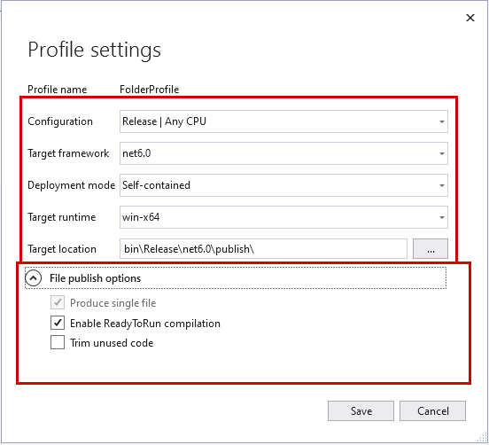

# MT799Task

## Description

Read files in MT799 format and write it to MSSQL database

## Build
1. Publish the project with these settings:

2. Run InstallService.bat as administrator

## How to work
Put your files in "C:\MT799" or change the path in ``appsettings.json`` and put the files there.
